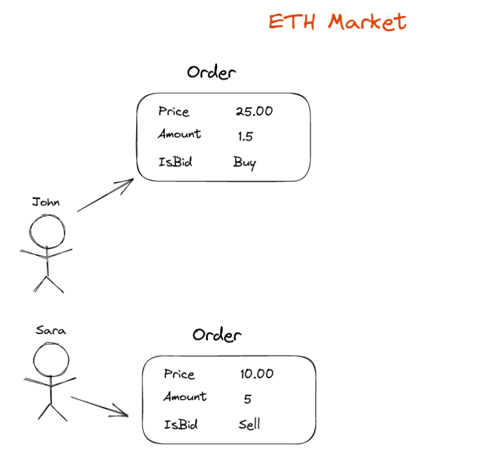
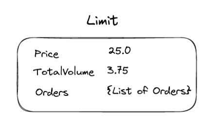
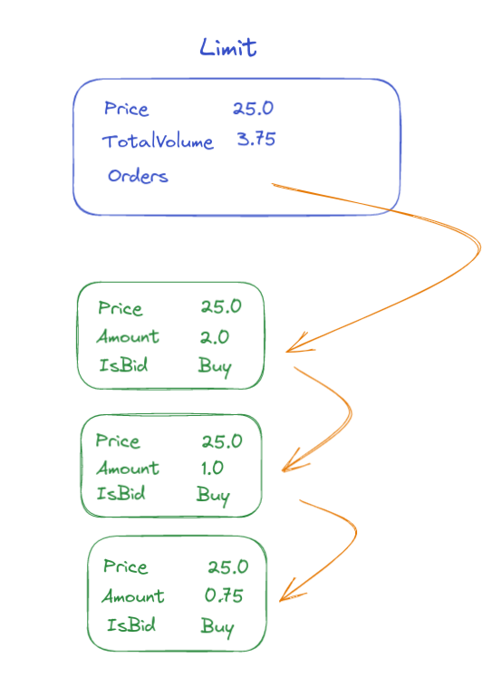
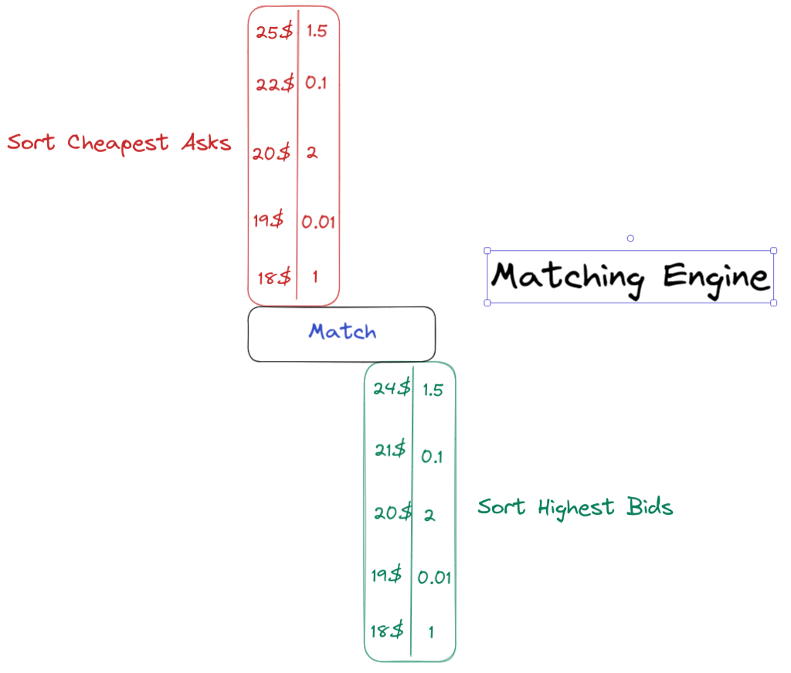

# Table of content

> This is an educational codebase that demonstrates how cryptocurrency exchanges and matching engines work. It's designed to help understand the core concepts and mechanics of order matching in trading systems.

- [Table of content](#table-of-content)
- [Code](#code)
- [Explanations](#explanations)
  - [Matching Engine, The Limit and The Orders](#matching-engine-the-limit-and-the-orders)
    - [What is Matching Engine](#what-is-matching-engine)
      - [What is it? how does it work? and how can it help?](#what-is-it-how-does-it-work-and-how-can-it-help)
    - [What is The Order](#what-is-the-order)
    - [What is The Limit](#what-is-the-limit)
    - [What is the matching engine job?](#what-is-the-matching-engine-job)
  - [Market Maker](#market-maker)
    - [What is the idea of MM](#what-is-the-idea-of-mm)
  - [APIs](#apis)
    - [Books](#books)
      - [Get market orderbook](#get-market-orderbook)
      - [Get best ask](#get-best-ask)
      - [Get best bid](#get-best-bid)
    - [Order](#order)
      - [Get user orders](#get-user-orders)
      - [Post user orders](#post-user-orders)
      - [Delete user orders](#delete-user-orders)

# Code

If you want to start reading code, start from the matchingengine directory.
For execute program you will need Ganache for private ETH environment.

# Explanations

## Matching Engine, The Limit and The Orders

### What is Matching Engine

#### What is it? how does it work? and how can it help?

A **matching engine** is a software component that sits at the core of a crypto exchange,
responsible for matching buy and sell orders from traders.
It works by continuously monitoring the **order book**,
which is a list of all the buy and sell orders that traders have placed on the exchange.

### What is The Order

Imagine there are two people, Sara and John, and each one has their own order request like this:

<p align="center">

</p>

Each order contains the price, amount of crypto or stock, and type of order, which can be a buy or sell order.

### What is The Limit

A **limit** is a group of orders at a certain price level. It's like a bucket of Orders with the same price but different amount
that is for different people.

<p align="center">

</p>

As I said, each **limit** can contain multiple orders like this:

<p align="center">

</p>

### What is the matching engine job?

In theory, what the **matching engine** does is simple.
The **matching engine** tries to sort the orders correctly in the first stage. Buyers' orders are sorted in descending order,
and sellers' orders are sorted in ascending order based on price.

<p align="center">

</p>

When a new order is placed,
the **matching engine** will look for the best available match among the existing orders in the **order book**. If a match is found,
the trade is executed and the orders are removed from the **order book**. If no match is found, the new order is added to the order book.

## Market Maker

#### What is the idea of MM

A market maker is a software program that automatically places buy and sell orders on an exchange to provide liquidity and stability for traders. This market maker, which is separate from the exchange, aims to enhance the trading experience by providing more consistent bid-ask spreads and increased trading activity.A market maker is a software program that automatically places buy and sell orders on an exchange in an effort to maintain liquidity and stability in the market.

## APIs

### Books

#### Get market orderbook

```
GET /books/{market}  (Currently we have only ETH market)
```

Response:

```JSON

  "TotalAsksVolume": 13000,
  "TotalBidsVolume": 13000,
  "Asks": [
    {
      "UserID": 7,
      "ID": 122540,
      "Amount": 1000,
      "IsBid": false,
      "Price": 9700,
      "Timestamp": 1674833074926966443
    },
    {
      "UserID": 7,
      "ID": 941318,
      "Amount": 1000,
      "IsBid": false,
      "Price": 9800,
      "Timestamp": 1674833074926969800
    },
    {
      "UserID": 7,
      "ID": 984059,
      "Amount": 1000,
      "IsBid": false,
      "Price": 9900,
      "Timestamp": 1674833074926971287
    },
    {
      "UserID": 8,
      "ID": 498081,
      "Amount": 10000,
      "IsBid": false,
      "Price": 10000,
      "Timestamp": 1674833074926974852
    }
  ],
  "Bids": [
    {
      "UserID": 7,
      "ID": 954425,
      "Amount": 1000,
      "IsBid": true,
      "Price": 9300,
      "Timestamp": 1674833074926977231
    },
    {
      "UserID": 7,
      "ID": 902081,
      "Amount": 1000,
      "IsBid": true,
      "Price": 9200,
      "Timestamp": 1674833074926977976
    },
    {
      "UserID": 7,
      "ID": 131847,
      "Amount": 1000,
      "IsBid": true,
      "Price": 9100,
      "Timestamp": 1674833074926978939
    },
    {
      "UserID": 8,
      "ID": 727887,
      "Amount": 10000,
      "IsBid": true,
      "Price": 9000,
      "Timestamp": 1674833074926982393
    }
  ]
}

```

#### Get best ask

```
GET /books/{market}/best/ask
```

Response:

```JSON
{
  "Price": 9700
}

```

#### Get best bid

```
GET /books/{market}/best/bid
```

Response:

```JSON
{
  "Price": 9400
}

```

### Order

#### Get user orders

```
GET /orders/{userID}
```

Response:

```JSON
{
  "Asks": [
    {
      "UserID": 8,
      "ID": 498081,
      "Amount": 10000,
      "IsBid": false,
      "Price": 10000,
      "Timestamp": 1674833061829744659
    }
  ],
  "Bids": [
    {
      "UserID": 8,
      "ID": 727887,
      "Amount": 10000,
      "IsBid": true,
      "Price": 9000,
      "Timestamp": 1674833061830209674
    }
  ]
}
```

#### Post user orders

```
POST /orders
```

Parameters:

```JSON
{
  "userID": 1,
  "Type": "LIMIT",
  "IsBid": true,
  "Amount": 1000,
  "Price": 90,
  "Market": "ETH"
}
```

Response:

```JSON
{
  "OrderID": 203300
}
```

#### Delete user orders

```
DELETE /orders/{orderID}
```

Response:

```JSON
{
  "msg": "Canceled"
}
```
