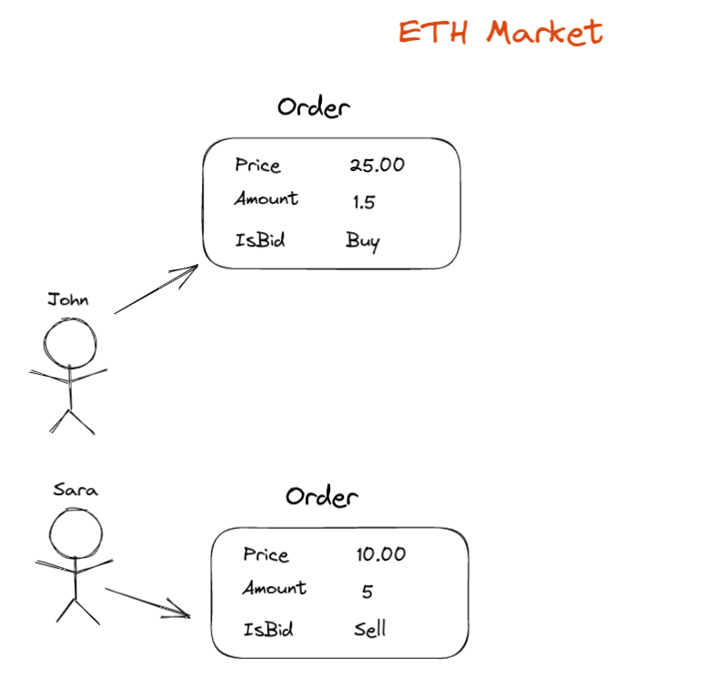

# Table of content

- [Code](#code)
- [Explanations](#explanations)
    * [Matching Engine, The Limit and The Orders](#matching-engine--the-limit-and-the-orders)
        + [What is Matching Engine](#what-is-matching-engine)
            - [What is it? how does it work? and how can it help?](#what-is-it--how-does-it-work--and-how-can-it-help-)
        + [What is The Order](#what-is-the-order)
        + [What is The Limit](#what-is-the-limit)
        + [What is the matching engine job?](#what-is-the-matching-engine-job-)
    * [Market Maker](#market-maker)
    * [APIs](#apis)

# Code
If you want to start reading code, start from the matchingengine directory.

# Explanations

## Matching Engine, The Limit and The Orders

### What is Matching Engine
#### What is it? how does it work? and how can it help?

A **matching engine** is a software component that sits at the core of a crypto exchange, 
responsible for matching buy and sell orders from traders. 
It works by continuously monitoring the **order book**, 
which is a list of all the buy and sell orders that traders have placed on the exchange.

### What is The Order
Imagine there are two people, Sara and John, and each one has their own order request like this:

Each order contains the price, amount of crypto or stock, and type of order, which can be a buy or sell order.

### What is The Limit
A **limit** is a group of orders at a certain price level. It's like a bucket of Orders with the same price but different amount
that is for different people.

As I said, each **limit** can contain multiple orders like this:

### What is the matching engine job?
In theory, what the **matching engine** does is simple.
The **matching engine** tries to sort the orders correctly in the first stage. Buyers' orders are sorted in descending order, 
and sellers' orders are sorted in ascending order based on price.

When a new order is placed,
the **matching engine** will look for the best available match among the existing orders in the **order book**. If a match is found,
the trade is executed and the orders are removed from the **order book**. If no match is found, the new order is added to the order book.

## Market Maker

## APIs
